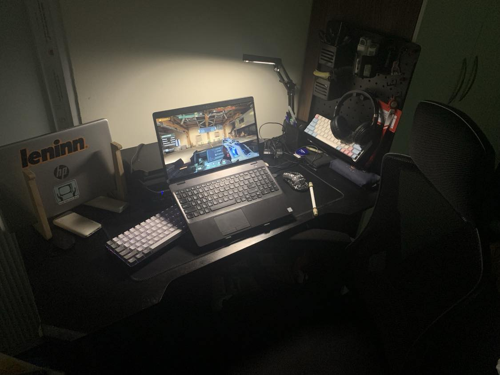

# Hi, i'm Long 👋

This GitHub repository showcases some of the major projects I've been working on while learning and growing. My dream is to become a full-stack developer, and right now, I'm focusing on building my skills in front-end development.

### I like take photo

  

    
    
    
    
  

### My GitHub Stats

  
  

  
### Most Used Languages

  

### Streak Stats

  

### Spotify recently played

  
  

  

